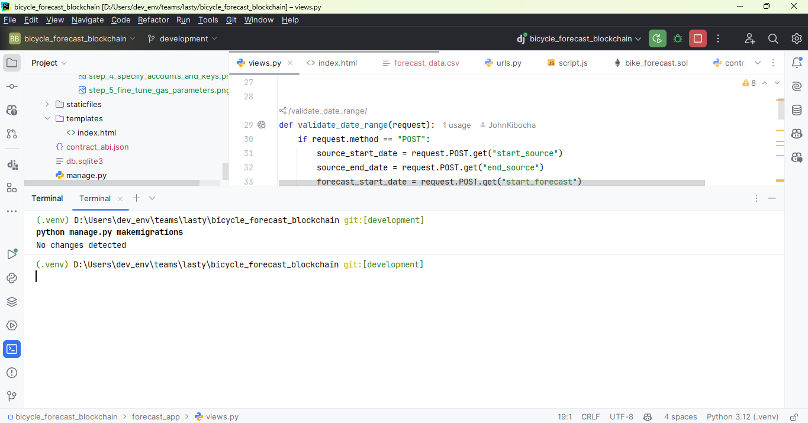
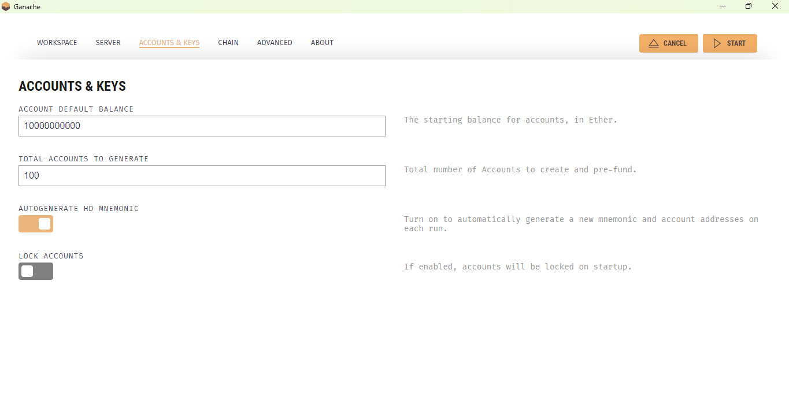

# **README: Blockchain-Enhanced Demand Forecasting System**

## **Introduction**

This project demonstrates a blockchain-integrated demand forecasting system for bicycle sales, utilizing Ethereum for secure data storage and Django for an interactive user interface. The system leverages the Moving Average Model for forecasting and ensures data transparency and integrity through blockchain.

## **Setup Instructions**

### **1. Preparing the Virtual Environment**

#### For Windows:
1. Open a terminal in the project directory.

2. Run `python -m venv .venv` to create a virtual environment.

3. Activate the environment with `.venv\Scripts\activate`.

#### For macOS/Linux:
1. Open a terminal in the project directory.
2. Run `python3 -m venv .venv` to create a virtual environment.
3. Activate the environment with `source .venv/bin/activate`.

Once the environment is activated, install the required dependencies using:
```bash
pip install -r requirements.txt
```

### **2. Setting Up the Database**

1. Run migrations to initialize the SQLite database:
   ```bash
   python manage.py collectstatic
   python manage.py makemigrations
   python manage.py migrate
   ```
   



2. Create a superuser for the admin panel with the following credentials:
    - Username: admin
    - Password: admin
    - Email: admin@admin.com

   Use the command below and follow the prompts:
   ```bash
   python manage.py createsuperuser
   ```
   


### **3. Configuring Ganache**

1. Download and install [Ganache](https://trufflesuite.com/ganache/).
2. Launch Ganache and create a new workspace:
    - Workspace Name: `bicycle_forecast_blockchain`
   
    
    
    - Leave the default configurations for the port.
   
   
    
    - In "Accounts and Keys":
        - Set "Balance" to `1000000000`.
        - Set "Accounts" to `100`.
        - Set "HD Mnemonic" to auto-generate.
    
        
        
        - Click "Create" to finalize the workspace setup.

### **4. Deploying and Initializing the Smart Contract**

1. Start the Django development server:
   ```bash
   python manage.py runserver
   ```

2. Access the forecasting application and attempt to generate a forecast. Initially, this will fail because the contract address in `forecast_app/blockchain/contract_init.py` is incorrect.

3. Check the terminal for a log entry similar to:
   ```
   INFO [contract_setup]: Contract deployed at {contract_address}
   ```
    

4. Copy the deployed contract address and update it in `forecast_app/blockchain/contract_init.py`:
   
```python
   contract_address = 'PASTE_YOUR_CONTRACT_ADDRESS_HERE'
   ```

5. Restart the Django server after updating the contract address:
   ```bash
   python manage.py runserver
   ```

## **Usage**

Once the setup is complete:
1. Log in to the admin panel at `http://127.0.0.1:8000/admin/` with the superuser credentials.
2. Access the forecasting interface through the main application.
3. Specify forecasting parameters to generate predictions.
4. Retrieve and verify forecast data via the User Interface.


## **System Limitations**

1. The system cannot forecast data older than 6 months.
2. Forecasting is restricted to a maximum of 3 months into the future.
3. The forecast start date must align with the end date of the provided historical data.

## **Troubleshooting**

- **Error: "Contract not deployed or initialized":** Ensure that Ganache is running and the contract address in `contract_init.py` is correct.
- **Database issues:** Re-run migrations and verify that the SQLite database is correctly initialized.
- **UI Errors:** Clear your browser cache or restart the Django server.

## **References**

- Ethereum documentation: [ethereum.org](https://ethereum.org/)
- Django documentation: [docs.djangoproject.com](https://docs.djangoproject.com/)
- Ganache setup: [trufflesuite.com](https://trufflesuite.com/ganache/)
- Python virtual environment setup: [python.org](https://docs.python.org/3/tutorial/venv.html)

